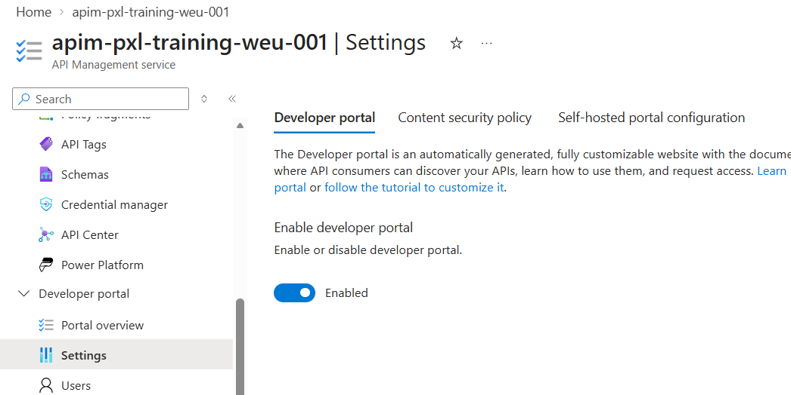
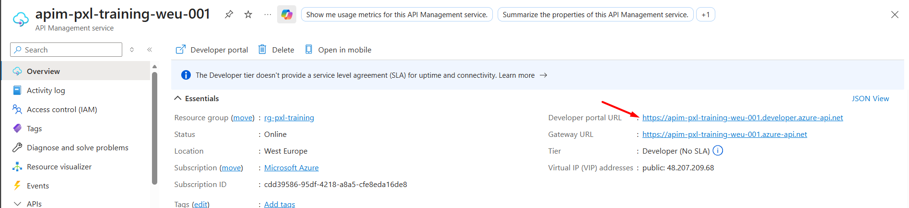
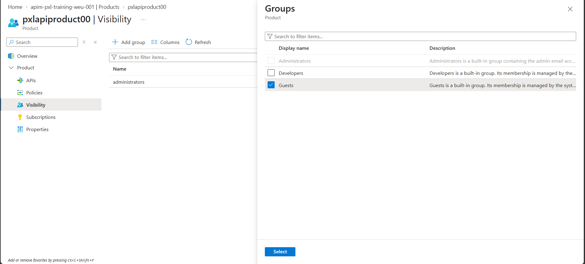
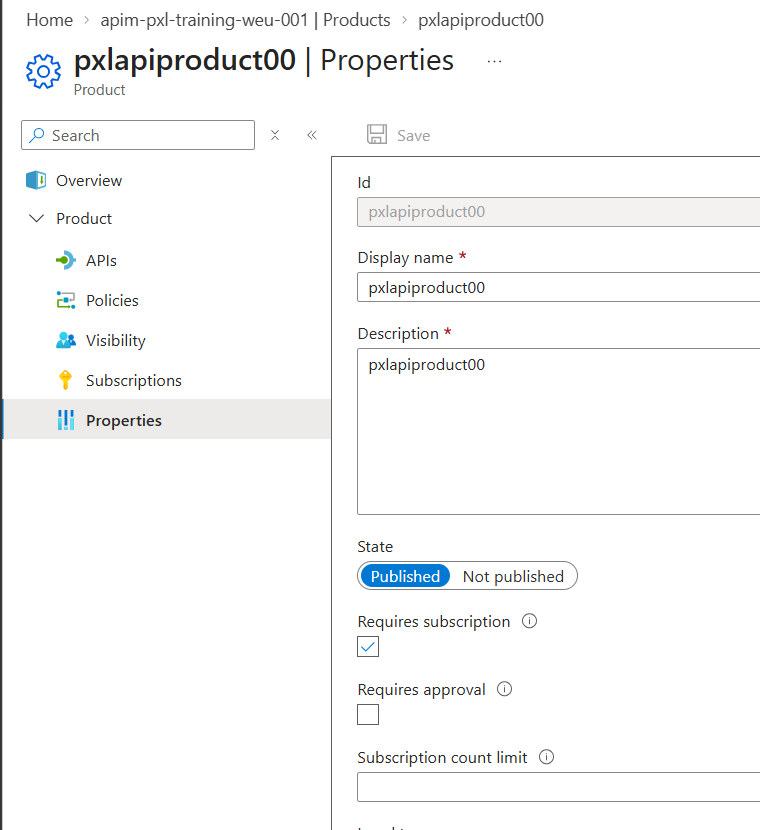
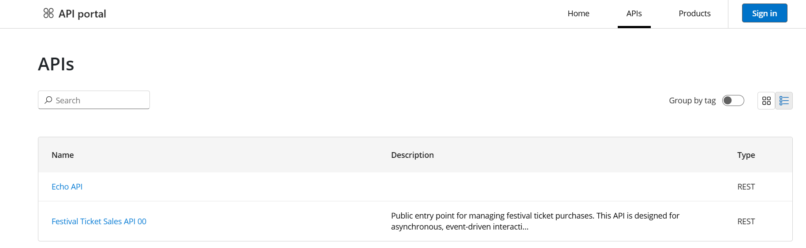
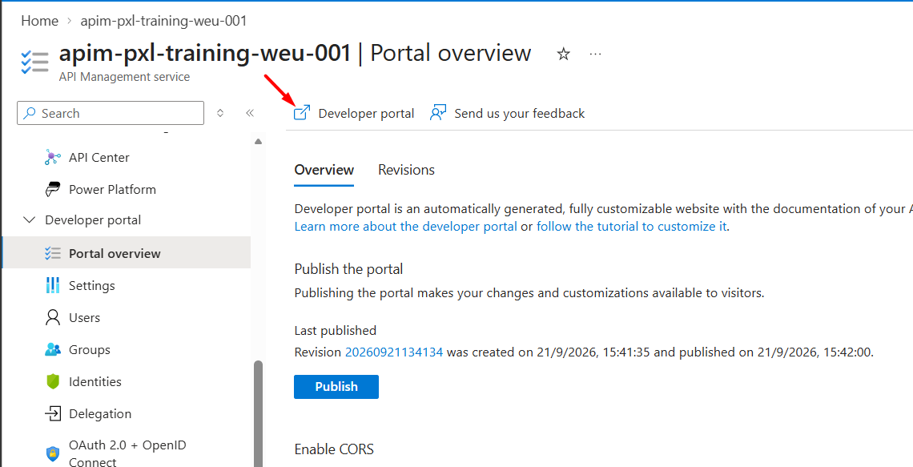
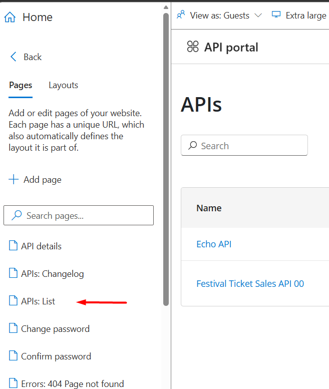
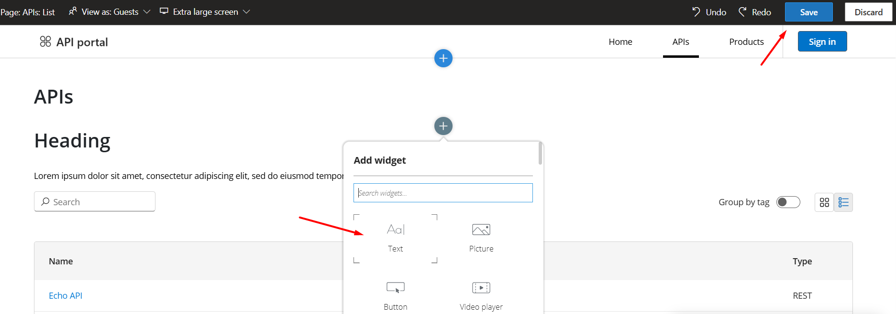

## Using the developer portal
The developer portal is an automatically generated, customizable website that shows your APIs and documentation. It is where API consumers can discover APIs, learn how to use them, and request access.

## Enabling developer portal
In the left-hand menu under **Developer portal**, select **Settings**.
Set the developer portal switch to **Enabled** if this is not yet the case, then click **Save**

  

>Imortant: Enabling developer portal might take up to 45 minutes. During the activation, other configuration changes are unavailable and API traffic might be affected.
 

## Visiting developer portal
Select **Overview** in the left-hand menu. Then click the **Developer portal URL**.

  

In the portal, open the **APIs** tab.

Only APIs that are both published and visible to your current user or group are listed here. Since we are not signed in, we will only see APIs that are visible to the **Guests** group.

## Publishing your API for guest access
To make your API visible to guest users in the developer portal, go to your API Management instance and select **Products** in the left-hand menu under **APIs**.

1. Click the product you created in the previous exercise.
2. Select **Visibility** in the left-hand menu.
3. Click **+ Add group**.
4. Check the **Guests** group and click **Select**.

  

Next, go to **Properties** in the left-hand menu and verify the following:

- **State** is set to **Published**
- **Requires subscription** is checked

  

APIs without a subscription are only visible to administrators in the developer portal, even if they are assigned to other groups.

If you return to the developer portal **APIs** tab and refresh the page, your API should appear.

  

Click on your API and inspect the operations. Users can also download the OpenAPI definition from here.

## Editing the developer portal
The layout and behavior of the developer portal can be customized. To try this, we will add a simple text widget to the APIs page.

1. In the Azure portal, open your API Management instance.
2. In the left-hand menu under **Developer portal**, select **Portal overview**.
3. Click **Developer portal**.

  

This button can also be found from the APIM **Overview** and **APIs** sections.

4. In the portal editor, go to **Pages** and click **APIs: List**.

  

5. Click the **+** icon to **Add widget** and choose **Text**.
6. Edit the text to something of your choosing.
7. Click **Save**, then **Close**.
8. Click **Publish** to make the change visible to users.

  

Once this is done, the text field will appear in the developer portal for all users. If the portal does not render correctly, try opening it in an incognito or private browsing window.