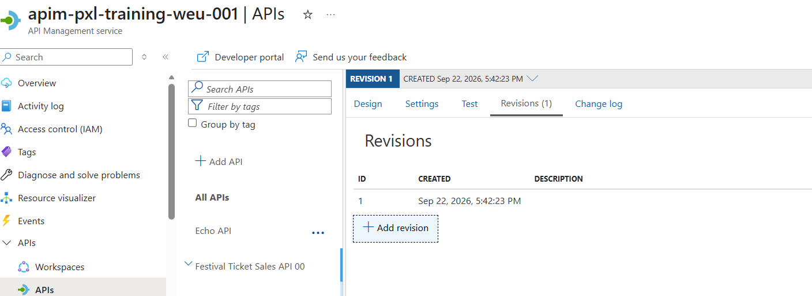
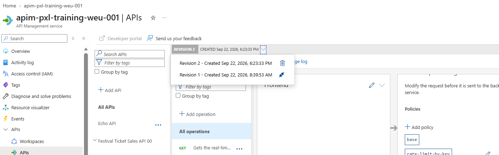
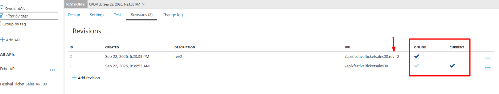
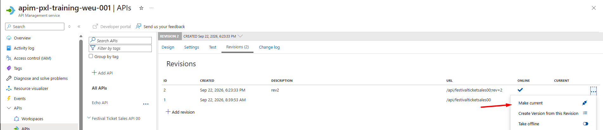
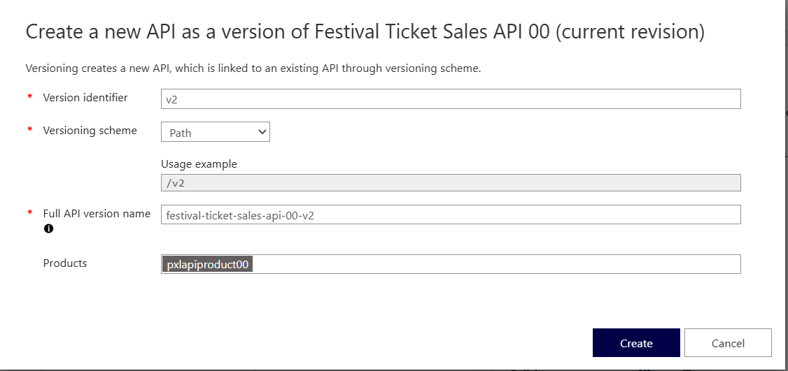
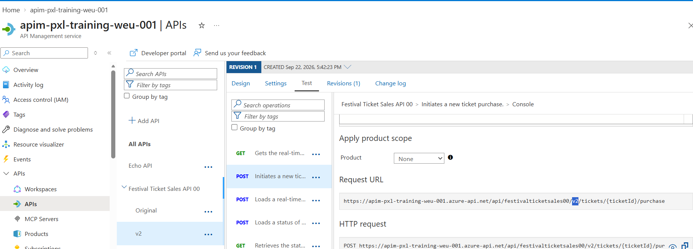

## Versioning & revisions

Use versioning if you want to keep multiple API versions online at the same time. Use revisions if you want to make, test and publish changes to one API while keeping just one version online.

### Create a revision
A revision is a copy of your API that you can use to test changes.

1. Open the **Festival Ticket Sales API xx** API in APIM.
2. Go to the **Revisions** tab.
3. Click **+ Add revision** and then **Create**.

  

4. Choose the revision you want to modify from the dropdown (Revision 2). 

  

5. Make a change to the revision, for example modify the inbound rate-limit policy.
6. To test the new revision, append `;rev=2` to the URL, as shown in the revision tab.

  Example:
  `https://apim-pxl-training-weu-001.azure-api.net/api/festivalticketsales00;rev=2/tickets/123/purchase`

  
  
 Requests can be sent to each online revision. The **Current** revision is the default endpoint.

7. Try calling both the default endpoint and the `;rev=2` endpoint and check whether only the new revision reflects the change.
8. When you are satisfied with the changes, make the new revision the current one.

  

The previous revision will keep its own URL, for example `...;rev=1`.

### Create a new API version
Versioning is used when you want to keep multiple live versions of the API available. This creates a separate API, so older and newer consumers can continue to use different versions at the same time.

1. Click the **...** next to the **Festival Ticket Sales API xx** API in APIM.
2. Select **Add version**.
3. Set the version identifier to `v2`.
4. Set **Full API version name** to `festival-ticket-sales-api-xx-v2`.
5. Select the **product** you created earlier.
6. Click **Create**.

  

7. The new version appears as a separate entry under the API.

  

Requests can be sent to both versions.